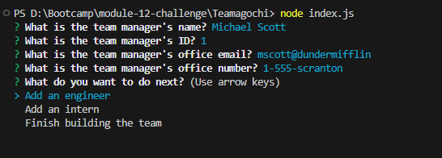
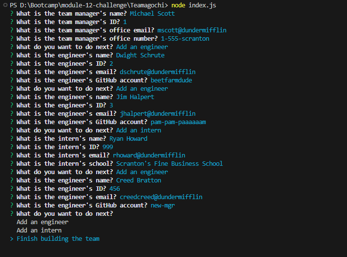
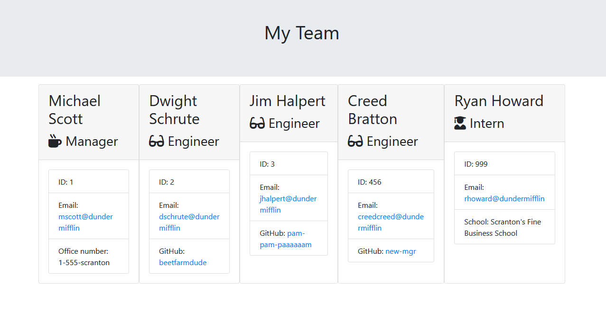
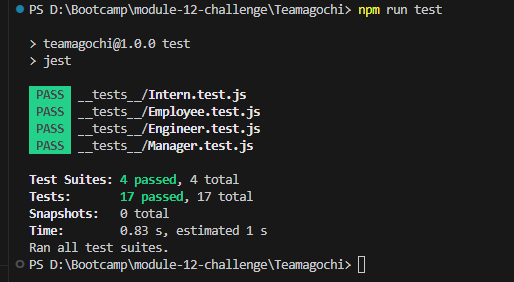

# Teamagochi
Bootcamp Module 12 - Team Profiler Generator

## Description
This is a team profiler generator app. It generates an HTML based on the command line inputs.

## Prerequisites
These components needed for succesful run
* Node.js v16.13.0
* Inquirer.js v6.5.2
* Jest 29.5.0

**Important!** Please use the exact component versions listed in prerequisites.

## Usage
```bash
node index.js
```

## Mockup
### Start


### Finish


### End Result



## Tests
The following tests were passed on Jest\


